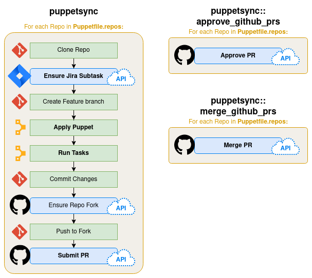

# puppetsync

<!-- vim-markdown-toc GFM -->

* [Description](#description)
* [Setup](#setup)
  * [Requirements](#requirements)
  * [Quickstart](#quickstart)
    * [Initial setup](#initial-setup)
    * [Preparing to run `puppetsync`](#preparing-to-run-puppetsync)
    * [Running `puppetsync`](#running-puppetsync)
    * [Running `puppetsync::approve_github_prs`](#running-puppetsyncapprove_github_prs)
    * [Running `puppetsync::merge_github_prs`](#running-puppetsyncmerge_github_prs)
* [Usage](#usage)
  * [Syncing repos](#syncing-repos)
  * [Inspecting pipeline stages](#inspecting-pipeline-stages)
* [Reference](#reference)
  * [Environment variables](#environment-variables)
  * [Puppetsync `config`](#puppetsync-config)
  * [Puppetsync `repolist`](#puppetsync-repolist)
  * [Plans](#plans)
    * [`puppetsync`](#puppetsync)
    * [`puppetsync::approve_github_prs`](#puppetsyncapprove_github_prs)
    * [`puppetsync::merge_github_prs`](#puppetsyncmerge_github_prs)
  * [Manually installing dependencies](#manually-installing-dependencies)
* [Troubleshooting](#troubleshooting)
  * [Error: `Ignoring <x> because its extensions are not built.`](#error-ignoring-x-because-its-extensions-are-not-built)
  * [Error: `puppetsync: parameter 'puppetfile' expects a Stdlib::Absolutepath`](#error-puppetsync-parameter-puppetfile-expects-a-stdlibabsolutepath)
* [Limitations](#limitations)

<!-- vim-markdown-toc -->

## Description

Run [Puppet Bolt Plans][bolt] to manage your GitHub repos' code like infrastructure-as-code!

  * Enforce a "baseline" across multiple GitHub repos, using [Puppet][puppet] and [Bolt][bolt] tasks
  * Automate the CM/workflow for each change: Jira, git commit messages, GitHub forks & PRs
  * Separate plans to submit, approve, and merge GitHub PRs, so different roles can run them (if required by CM policy)





## Setup

### Requirements

* [Puppet Bolt 2.15+][bolt] (Bolt 3.0+ recommended), installed from an [OS
  package][bolt-install] (don't use the RubyGem)
* The `git` command must be available
  * SSH + ssh-agent must be set up to push changes
* Some specific [environment variables](#environment-variables) are required
  to handle API authentication (e.g., GitHub)
* Runtime dependencies (installed by `./Rakefile install`)
  * Puppet modules (defined in bolt project's `Puppetfile`):
  * Ruby Gems (defined in `gem.deps.rb`): octokit, jira-ruby, etc


### Quickstart

#### Initial setup

1. Before running any plans, from the top level of this repository:

   ```sh
   command -v rvm && rvm use system    # make sure you're using packaged `bolt`
   ./Rakefile install                  # Install Puppet module and Ruby Gem deps
   bolt plan show                      # Validate bolt is working;
                                       #   verify `puppetsync::` plans are visible
   ```

2. Set the [environment variable](#environment-variables) `GITHUB_API_TOKEN`.
   * Before using the main `puppetsync::` plan, also set `JIRA_USER`,
     `JIRA_API_TOKEN`, and `GITLAB_API_TOKEN`

4. At this point, you are ready to run a plan.  The plan to run will depend on your role:

   | Plan | Role | Purpose |
   | --- | --- | --- |
   | **`puppetsync`** | Maintainer | Applies baseline to each repo, submits changes as PRs |
   | **`puppetsync::approve_github_prs`** | Approver | Approves all PRs from a specific `puppetsync` session |
   | **`puppetsync::merge_github_prs`** | Maintainer | Merges all approved PRs from a specific `puppetsync` |


#### Preparing to run `puppetsync`

:warning: You only need to change these files when preparing a new
`puppetsync`!

1. Find/add a repolist file for the repos you want to affect under
   `data/sync/repolists/`
2. Copy and customize a Puppetsync config file under `data/sync/configs/` to
   fit your workflow
3. Set [environment variables](#environment-variables) for GITHUB, GITLAB, and
   JIRA API authentication
4. (Optional) Develop Puppet code/Hiera data/Tasks to provide new features

Note: If you are just approving or merging PRs, you will reuse the repolist and
config files from the puppetsync session you used.

#### Running `puppetsync`


```sh
# (PROTIP: don't actually expose API tokens on the CLI when running commands)

GITHUB_API_TOKEN=$GITHUB_API_TOKEN \
  JIRA_USER=$JIRA_USER \
  JIRA_API_TOKEN=$JIRA_API_TOKEN \
  GITLAB_API_TOKEN=$JIRA_API_TOKEN \
    bolt plan run puppetsync config={CONFIG_NAME} repolist={REPOLIST_NAME}
```

See the [`puppetsync`](#puppetsync) reference for details.

#### Running `puppetsync::approve_github_prs`


```sh
GITHUB_API_TOKEN=$GITHUB_API_TOKEN \
    bolt plan run puppetsync::approve_github_prs
```

See the [`puppetsync::approve_github_prs`](#puppetsyncapprove_github_prs) reference for details.

#### Running `puppetsync::merge_github_prs`

```sh
GITHUB_API_TOKEN=$GITHUB_API_TOKEN \
    bolt plan run puppetsync::merge_github_prs
```

See the [`puppetsync::merge_github_prs`](#puppetsyncmerge_github_prs) reference for details.


## Usage

### Syncing repos

After [setup](#setup), sync all repos by running:

        /opt/puppetlabs/bin/bolt plan run puppetsync \
          config=CONFIG_NAME repolist=REPOLIST_NAME

If the config and repolist's  `latest.yaml` files are symlinked to the target
config and repolist, you don't have to specify `config=` or `repolist=`
(for brevity, following examples will assume this is
the case):

        /opt/puppetlabs/bin/bolt plan run puppetsync

To see what's going on under the hood (potentially less irritating when
`apply()` appears to hang for a long time when updating a lot of repos):

        /opt/puppetlabs/bin/bolt plan run puppetsync --log-level info

        # Alternatively (warning: LOTS of info):
        /opt/puppetlabs/bin/bolt plan run puppetsync --log-level debug


### Inspecting pipeline stages

To list all pipeline stages in a plan (and inspect which stages will be
skipped), run:

        bolt plan run puppetsync options='{"list_pipeline_stages": true}' \
          config=CONFIG_NAME repolist=REPOLIST_NAME

These steps can be specified/commented out in the [Puppetsync `config`] file,
under the corresponding plan.

**Example:**

```sh
bolt plan run puppetsync \
  options='{"list_pipeline_stages": true}' \
  github_token=x jira_username=x  jira_token=x

#   Starting: plan puppetsync
#   ===== SKIPPING PIPELINE STAGE DUE TO CONFIGURATION: install_gems
#   - checkout_git_feature_branch_in_each_repo
#   - ensure_jira_subtask
#   - apply_puppet_role
#   - modernize_gitlab_files
#   - lint_gitlab_ci
#   - git_commit_changes
#   - ensure_github_fork
#   - ensure_git_remote
#   - git_push_to_remote
#   - ensure_gitlab_remote
#   - git_push_to_gitlab
#   - ensure_github_pr
#   Finished: plan puppetsync in 0.04 sec
#   Plan completed successfully with no result
```

At the time the command above was run, the corresponding
[Puppetsync `config`] file contained the following
`puppetsync.plans.sync.stages`:

```yaml
puppetsync:
  plans:
    sync:
      stages:
        # - install_gems
        - checkout_git_feature_branch_in_each_repo
        - ensure_jira_subtask
        - apply_puppet_role
        - modernize_gitlab_files
        - lint_gitlab_ci
        - git_commit_changes
        - ensure_github_fork
        - ensure_git_remote
        - git_push_to_remote
        - ensure_gitlab_remote
        - git_push_to_gitlab
        - ensure_github_pr
```


## Reference

### Environment variables

These environment variables are necessary to create Jira subtasks:

| Env variable | Purpose   |                           |
| ------------ | -------   | ------------------------- |
| `JIRA_USER`  | Jira user | Probably an email address |
| `JIRA_API_TOKEN` | Jira API token | You MUST generate an API token (basic auth no longer works). To do so, you must have Jira instance access rights.  You can generate a token here: https://id.atlassian.com/manage/api-tokens |

These environment variables are necessary to fork GitHub repositories and submit Pull Requests:

| Env variable       | Purpose          |     |
| ------------       | -------          | --- |
| `GITHUB_API_TOKEN` | GitHub API token |     |

These environment variables are necessary to use GitLab's CI lint API:

| Env variable       | Purpose                   |                      |
| ------------       | -------                   | -------------------- |
| `GITLAB_API_TOKEN` | GitLab Personal API Token | Requires `api` scope |

(Recommended) To stop Bolt from collecting analytics, set this environment variable:

| Env variable                  | Purpose                                                                           |     |
| ------------                  | -------                                                                           | --- |
| `BOLT_DISABLE_ANALYTICS=true` | Prevent bolt's analytics from phoning home to tell Puppet about everything you do |     |

### Puppetsync `config`

The workflow of a specific Puppetsync session (sync -> apply -> merge of
related PRs) is controlled by a single configuration data structure, defined
in Hiera using the key `puppetsync::plan_config`.

Typically, the `puppetsync::plan_config` data structure is defined in its own
Hiera YAML file, located at `data/sync/configs/{CONFIG_NAME}.yaml`.
The Hiera file's name is is the `CONFIG_NAME` in a Puppetsync plan's
`config=CONFIG_NAME`

Example:

```yaml
---
puppetsync::plan_config:
  permitted_project_types:
    - pupmod
    - pupmod_skeleton
  plans:
    # clone_git_repos: false     # set to `false` when applying manual updates on a second run
    # clear_before_clone: false  # set to `false` when applying manual updates on a second run
    sync:
      stages:
        - install_gems
        - checkout_git_feature_branch_in_each_repo
        - ensure_jira_subtask
        - apply_puppet_role
        - modernize_gitlab_files
        - lint_gitlab_ci
        - git_commit_changes
        - ensure_github_fork
        - ensure_git_remote
        - git_push_to_remote
        - ensure_gitlab_remote
        - git_push_to_gitlab
        - ensure_github_pr

    approve_github_pr:
      clone_git_repos: false
      stages:
        - install_gems
        - approve_github_pr_for_each_repo

    merge_github_pr:
      clone_git_repos: false
      stages:
        - install_gems
        - merge_github_pr_for_each_repo

jira:
  parent_issue: SIMP-7035
  project: SIMP
  jira_site: https://simp-project.atlassian.net
  subtask_title: 'Update .travis.yml pipeline in %COMPONENT%'

  # optional subtask fields:
  subtask_story_points: 1
  subtask_assignee: 'chris.tessmer'

git:
  commit_message: |
    (%JIRA_PARENT_ISSUE%) Update to new Travis CI pipeline

    This patch updates the Travis Pipeline to a static, standardized format
    that uses project variables for secrets. It includes an optional
    diagnostic mode to test the project's variables against their respective
    deployment APIs (GitHub and Puppet Forge).

    [%JIRA_PARENT_ISSUE%] #comment Update to latest pipeline in %COMPONENT%
    [%JIRA_SUBTASK%] #close

github:
  pr_user: op-ct  # This should be the account that *submitted* the PRs (Used
                  # by idempotency checks when approving/merging PRs)
  approval_message: ':+1: lgtm'
```

### Puppetsync `repolist`

Data about each repo/branch to target.
The data is defined in a Hiera YAML file, located at
`data/sync/repolists/{REPOLIST_NAME}.yaml`.
Each repolist is named after its file.


```yaml
puppetsync::repos_config:

  https://github.com/simp/pupmod-simp-acpid:
    branch: master

  https://github.com/simp/pupmod-simp-aide:
    branch: master

  https://github.com/simp/pupmod-simp-at:
    branch: master

  https://github.com/simp/pupmod-simp-auditd:
    branch: master

  # ... and so on
```

### Plans

Each plan:

* Reads its config data from the [Puppetsync `config`] file
* Reads its repolist data from the [Puppetsync `repolist`] file
* Has its own specific configuration under the keys (`plans.sync`,
  `plans.approve_github_pr`, and `plans.merge_github_pr`)
* Executes its workflow as a series of pipeline stages for each repo in the
  repolist file (in Hiera at `data/sync/configs/{CONFIG_FILE}.yaml`).

#### `puppetsync`

The main plan (`puppetsync`) clones and updates each repo in the [Puppetsync `repolist`].
It (idempotently) ensures a Jira subtask and GitHub PR exists for each change.

Workflow:

1. Clone `:git` repositories defined in the [Puppetsync `repolist`]
   * (disable with `clone_git_repos: false`)

It will then execute the following pipeline stages for each repo (in parallel):

2. Ensure a Jira subtask exists to track the change
3. Check out a new git feature branch
4. Apply Puppet manifests to enforce a common repository asset baseline
5. Commit changes to git with a templated commit message (`git.commit_message`)
6. Ensure the user has forked repository on GitHub
7. Push changes up to the user's forked repository
8. Submit a Pull Request to merge the changes back the original repository and branch

If an individual repo encounters failures during a stage, it will be held back
while the other repos proceed with their workflows.

All failures are summarized after the full plan finishes executing.

#### `puppetsync::approve_github_prs`

Idempotently approves every open PR from user `github.pr_user` on
branch `jira.parent_issue` for each repo in the [Puppetsync `repolist`].

#### `puppetsync::merge_github_prs`

Idempotently merges every approved PR from user `github.pr_user` on
branch `jira.parent_issue` for each repo in the [Puppetsync `repolist`].

### Manually installing dependencies

Use `bolt` to download the project's dependencies from `Puppetfile` and
`gems.deps.rb`:

       /opt/puppetlabs/bolt/bin/gem install --user-install -g gem.deps.rb
       /opt/puppetlabs/bin/bolt puppetfile install

 The Rakefile can be used as a shortcut:

      ./Rakefile install


## Troubleshooting

### Error: `Ignoring <x> because its extensions are not built.`

**Cause:** Running `bolt plan run puppetsync` from a Ruby interpreter other
than the `bolt` package.

**Fix:** Make sure you're not using RVM.  If necessary, invoke the packaged
bolt executable directly:

```sh
command -v rvm && rvm use system    # make sure you're using the packaged `bolt`
./Rakefile install                  # Install Puppet module and Ruby Gem deps
bolt plan show --filter puppetsync  # Validate bolt is working

## ^^^ If that still didn't work:
# /opt/puppetlabs/bolt/bin/bolt show --filter puppetsync
```

**Characteristic error messages:**

```
Ignoring bcrypt_pbkdf-1.0.1 because its extensions are not built. Try: gem pristine bcrypt_pbkdf --version 1.0.1
Ignoring byebug-11.1.3 because its extensions are not built. Try: gem pristine byebug --version 11.1.3
Ignoring byebug-11.1.1 because its extensions are not built. Try: gem pristine byebug --version 11.1.1
Ignoring byebug-11.0.1 because its extensions are not built. Try: gem pristine byebug --version 11.0.1
Ignoring ed25519-1.2.4 because its extensions are not built. Try: gem pristine ed25519 --version 1.2.4
Ignoring executable-hooks-1.6.0 because its extensions are not built. Try: gem pristine executable-hooks --version 1.6.0
Ignoring ffi-1.12.2 because its extensions are not built. Try: gem pristine ffi --version 1.12.2
...
```

### Error: `puppetsync: parameter 'puppetfile' expects a Stdlib::Absolutepath`

**Cause:** Running `bolt plan run puppetsync puppetfile=` with relative path to the
desired Puppetfile.

**Fix:** Use an absolute path to reference the Puppetfile you want:

```sh
bolt plan run puppetsync puppetfile="$PWD/Puppetfile.skeleton"
```

**Characteristic error message:**

```
{
  "kind": "bolt/pal-error",
  "msg": "puppetsync: parameter 'puppetfile' expects a Stdlib::Absolutepath = Variant[Stdlib::Windowspath = Pattern[/^(([a-zA-Z]:
[\\\\\\/])|([\\\\\\/][\\\\\\/][^\\\\\\/]+[\\\\\\/][^\\\\\\/]+)|([\\\\\\/][\\\\\\/]\\?[\\\\\\/][^\\\\\\/]+))/], Stdlib::Unixpath =
 Pattern[/^\\/([^\\/\\0]+\\/*)*$/]] value, got String",
  "details": {
  }
```


## Limitations

* Requires git to be configured with SSH, with keys loaded into a running agent
* Probably only works from an \*nix host

[bolt]: https://puppet.com/docs/bolt/latest/bolt.html
[puppet]: https://puppet.com/docs/puppet/latest/
[bolt-install]: https://puppet.com/docs/bolt/latest/bolt_installing.html
[Puppetsync `config`]: #puppetsync-config
[Puppetsync `repolist`]: #puppetsync-repolist
